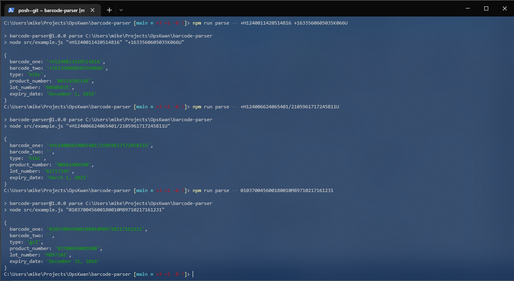

# OpsKwan Barcode Parser

Parses HIBC and GS1 barcodes

## Example

This has been setup with a simple node example to show how to use the parse_barcode module. To run the example [install node](https://github.com/nvm-sh/nvm#installing-and-updating) and run `npm run parse barcode-one barcode-two`

```
> npm run parse -- +H1240011420514816 +1633560605035K066U

> barcode-parser@1.0.0 parse C:\Users\mike\Projects\OpsKwan\barcode-parser
> node src/example.js "+H1240011420514816" "+1633560605035K066U"

{
  barcode_one: '+H1240011420514816',
  barcode_two: '+1633560605035K066U',
  type: 'hibc',
  product_number: '00114205148',
  lot_number: '60605035',
  expiry_date: 'December 1, 2016'
}
```


